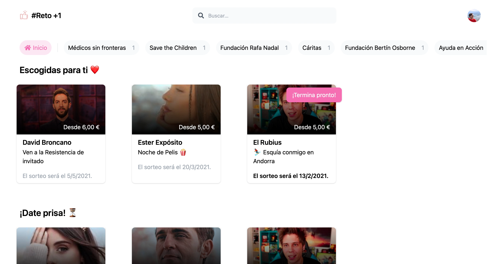

# Reto +1

## What is this?

This is Hackathon project for Minube Social Hack 2021.

It's a platform to engage celebrities and commoners for a common cause.
Celebrities offer first-hand experiences and all the profits go to NGOs.

## Live demo

There's a **live demo** at [retomasuno.furstenheim.com](http://retomasuno.furstenheim.com/).

Use `4242 4242 4242 4242` as credit card number to pay.
pi

## Recorded demo

Do you prefer a <60 seconds demo? [Here you go](https://drive.google.com/file/d/1o6HiVdp7ZfiJx_13GDhM_6hbpdeQnwDi/view).

[](https://drive.google.com/file/d/1o6HiVdp7ZfiJx_13GDhM_6hbpdeQnwDi/view)

## Running the app

You have to start the frontend and the backend, to do so:

- **Frontend**: `yarn --cwd frontend && yarn --cwd frontend dev`. It listens on port `3000`.
- **Backend**: `yarn --cwd server && yarn --cwd server watch`. It listens on port `3001`.

If you want full Stripe integration you'll need the [Stripe CLI](https://github.com/stripe/stripe-cli). After it is installed you can forward webhooks to your local server using this snippet:

```bash
source server/test.env && stripe listen --forward-to localhost:3001/webhook --api-key $STRIPE_API_KEY
```
